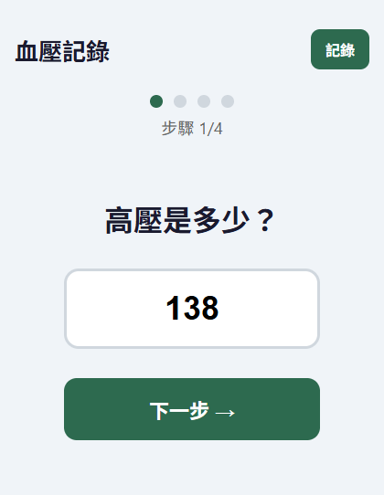
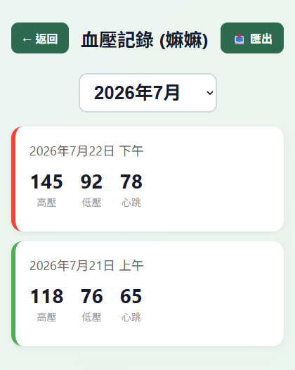
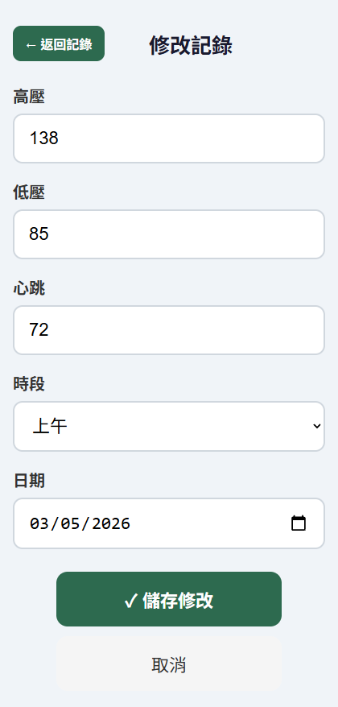

# 血壓記錄系統

<br>

一個用 Node.js、Express、MariaDB 打造的血壓記錄網站，專為長輩設計，簡單易用。

<br>

## 功能特色

<br>

- **長者友善 4 步驟引導輸入** — 逐步輸入高壓、低壓、心跳，日期時段自動填入
- **卡片式記錄列表** — 依月份分組，左右箭頭切換月份或下拉選單直選
- **血壓分級顏色提示** — 🟢 正常 / 🔴 高血壓
- **Excel 匯出** — 日曆格式報表，含血壓分級顏色標示
- **可自訂標題** — 透過 `TITLE_SUFFIX` 環境變數，支援多人家族使用（如「血壓記錄 (嫲嫲)」）
- **PWA 支援** — 可安裝到手機主畫面，像原生 App 般使用
- **Docker 一鍵部署** — 可自建資料庫或連 Synology NAS
- **響應式設計** — 手機、平板、電腦都適用

<br>

## 快速開始

<br>

### 方式一：Docker（推薦）

```bash
# 使用外部資料庫（如 Synology NAS）
TITLE_SUFFIX=嫲嫲 docker compose up -d --build
```

### 方式二：手動安裝

#### 環境需求

- Node.js >= 20
- MariaDB >= 10.6

#### 安裝步驟

```bash
npm install
```

#### 建立資料庫

```sql
CREATE DATABASE blood_test;
CREATE TABLE records (
    id INT AUTO_INCREMENT PRIMARY KEY,
    high_pressure INT NOT NULL,
    low_pressure INT NOT NULL,
    heartbeat INT NOT NULL,
    recorded_at TIMESTAMP DEFAULT CURRENT_TIMESTAMP
);
```

#### 環境變數

| 變數 | 說明 | 預設值 |
|------|------|--------|
| `DB_HOST` | 資料庫主機 | `192.168.1.222` |
| `DB_USER` | 資料庫帳號 | `tracker_user` |
| `DB_PASSWORD` | 資料庫密碼 | |
| `DB_NAME` | 資料庫名稱 | `blood_test` |
| `PORT` | 網站埠號 | `3000` |
| `TITLE_SUFFIX` | 標題後綴（如 `嫲嫲`） | |

#### 啟動

```bash
TITLE_SUFFIX=嫲嫲 node server.js
```

<br>

## Docker 部署

<br>

### 使用外部資料庫（如 Synology NAS）

```yaml
services:
  app:
    build: .
    ports:
      - "3000:3000"
    environment:
      TZ: Asia/Hong_Kong
      DB_HOST: 192.168.1.222
      DB_USER: tracker_user
      DB_PASSWORD: 'your_password'
      DB_NAME: blood_test
      TITLE_SUFFIX: ${TITLE_SUFFIX:-}
    restart: unless-stopped
```

### 多人家族使用

```bash
# 給嫲嫲用
TITLE_SUFFIX=嫲嫲 docker compose up -d

# 給爸爸用（不同埠號）
TITLE_SUFFIX=爸爸 docker compose -p dad up -d
# 修改 ports 為 "3001:3000"
```

<br>

## 版本紀錄

<br>

* 0.1 — 初始版本
* 0.2 — UI 更新，新增成功提示
* 0.3 — 錯誤修正，自動重新連線
* 0.3.5 — CSV 輸出優化
* 0.4 — CSV 檔名格式、網站圖示
* 0.5 — 改用 Excel 匯出、版面調整
* 0.5.1 — 無資料時匯出錯誤修正
* 0.6 — 記錄按月分組、新增修改功能
* **1.0** — 長者友善改版、4 步驟輸入、卡片檢視、PWA、Docker、Excel 顏色標示

<br>

## 畫面截圖

<br>



<br>



<br>



<br>

## 作者

<br>

[shamough1792](https://github.com/shamough1792)

<br>

## 授權

<br>

本專案採用 MIT 授權 — 詳見 [LICENSE.md](LICENSE.md)

<br>
