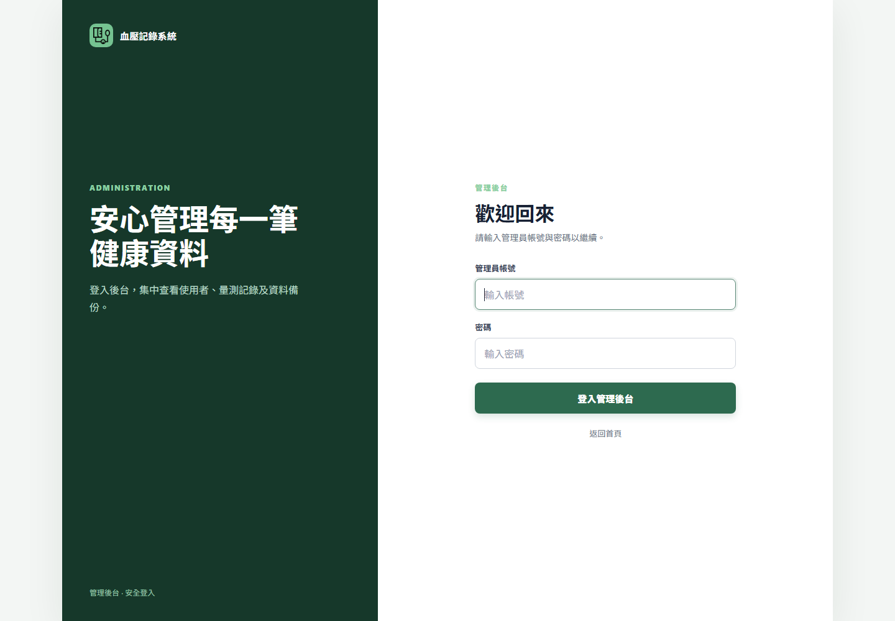

# 血壓記錄系統

> 專為家庭與長輩設計的多使用者血壓記錄網站，支援月曆、趨勢統計、Excel 匯出、管理後台及 Docker 部署。

## 目錄

- [功能特色](#功能特色)
- [快速開始](#快速開始)
- [環境變數](#環境變數)
- [管理後台與備份](#管理後台與備份)
- [健康檢查](#健康檢查)
- [畫面截圖](#畫面截圖)
- [既有資料庫升級](#既有資料庫升級)
- [本機開發](#本機開發)
- [版本紀錄](#版本紀錄)

## 功能特色

- **多使用者 Portal**：家庭成員各自保存記錄，透過大頭貼快速切換。
- **長者友善輸入流程**：四步驟完成血壓記錄，支援上午、下午及補錄時段。
- **月曆與單日詳情**：以早／晚狀態顯示每月記錄，並可查看或修改單日資料。
- **趨勢與健康摘要**：統計收縮壓、舒張壓與心跳變化，圖表支援放大檢視。
- **清晰的血壓分級**：以綠、藍、紅色區分正常、低血壓及高血壓。
- **匯出與備份**：支援 Excel 匯出，以及附 SHA-256 checksum 的版本化 JSON 備份。
- **管理後台**：管理使用者與記錄、進階篩選、近期統計及系統狀態。
- **PWA 與 Docker**：可安裝至手機主畫面，並支援 GHCR image、Docker Compose 及外部 MariaDB。

## 快速開始

### Docker（推薦）

先準備可連線的 MariaDB 資料庫，並匯入 [mariadb/init.sql](mariadb/init.sql)。接著建立 <code>compose.yml</code>：

~~~yaml
services:
  app:
    image: ghcr.io/shamough1792/blood_pressure_tracker:2.9.0
    ports:
      - "3000:3000"
    environment:
      TZ: Asia/Hong_Kong
      DB_HOST: 192.168.1.222
      DB_USER: tracker_user
      DB_PASSWORD: your_database_password
      DB_NAME: blood_test
      ADMIN_USER: admin
      ADMIN_PASSWORD: your_admin_password
      SESSION_SECRET: your_random_session_secret
    restart: unless-stopped
~~~

啟動服務：

~~~bash
docker compose up -d
~~~

開啟：

- 使用者入口：<http://localhost:3000>
- 管理後台：<http://localhost:3000/admin>

> 正式環境建議固定使用完整版本標籤（例如 <code>2.9.0</code>），確認升級後再更新；<code>latest</code> 會隨最新正式版移動。

### 從原始碼建置 Docker image

~~~bash
git clone https://github.com/shamough1792/Blood_Pressure_Tracker.git
cd Blood_Pressure_Tracker
docker compose up -d --build
~~~

啟動前請在 [docker-compose.yml](docker-compose.yml) 填入資料庫及管理員環境變數。

## 環境變數

| 變數 | 必填 | 說明 | 預設值 |
| --- | :---: | --- | --- |
| <code>DB_HOST</code> | 是 | MariaDB 主機名稱或 IP | — |
| <code>DB_USER</code> | 是 | MariaDB 使用者 | — |
| <code>DB_PASSWORD</code> | 是 | MariaDB 密碼 | — |
| <code>DB_NAME</code> | 是 | 資料庫名稱 | — |
| <code>DB_POOL_SIZE</code> | 否 | 資料庫連線池上限 | <code>10</code> |
| <code>PORT</code> | 否 | Web 服務埠號 | <code>3000</code> |
| <code>ADMIN_USER</code> | 是 | 管理後台帳號 | — |
| <code>ADMIN_PASSWORD</code> | 是 | 管理後台密碼 | — |
| <code>SESSION_SECRET</code> | 是 | Session cookie 簽名密鑰 | — |
| <code>TZ</code> | 否 | 伺服器時區 | 依執行環境 |

產生高熵 <code>SESSION_SECRET</code>：

~~~bash
node -e "console.log(require('crypto').randomBytes(32).toString('base64url'))"
~~~

若 <code>ADMIN_USER</code>、<code>ADMIN_PASSWORD</code> 或 <code>SESSION_SECRET</code> 未設定，服務會拒絕啟動。

## 管理後台與備份

管理後台位於 <code>/admin</code>，登入後可：

- 管理使用者及血壓記錄。
- 依使用者、日期及血壓條件篩選記錄。
- 查看以伺服器日期計算的今日記錄與指定使用者最近 7 日統計。
- 下載 JSON 或舊版 SQL 備份。
- 預覽 JSON 匯入結果，再以資料庫交易寫入。

JSON 是目前建議的備份格式，檔案包含格式版本與 SHA-256 checksum。匯入時會先顯示有效、略過及總筆數，確認後才寫入資料庫。

### 部署安全建議

- 使用 HTTPS reverse proxy 提供外部存取。
- 不要直接將應用程式的 <code>3000</code> port 暴露至公網。
- 定期備份資料庫或下載 JSON 備份。
- Session cookie 使用 <code>HttpOnly</code> 與 <code>SameSite=Lax</code>；production 模式會加上 <code>Secure</code>。

## 健康檢查

| 端點 | 用途 | 成功狀態 |
| --- | --- | :---: |
| <code>GET /health</code> | 確認 Node.js 程序正在運行 | <code>200</code> |
| <code>GET /ready</code> | 確認應用程式可連線至資料庫 | <code>200</code> |

資料庫不可用時 <code>/ready</code> 會回傳 <code>503</code>。官方 Docker image 已內建 <code>HEALTHCHECK</code>。

## 畫面截圖

| 使用者入口 | 記錄首頁 |
| --- | --- |
|  |  |

| 月曆記錄 | 單日詳細記錄 |
| --- | --- |
|  |  |

| 統計頁 | 管理後台 |
| --- | --- |
|  |  |

管理員登入頁

## 既有資料庫升級

升級前請先備份資料庫。從較早版本升級至 <code>2.9.0</code> 時，請套用記錄查詢索引：

~~~bash
mysql -h <DB_HOST> -u <DB_USER> -p <DB_NAME> < mariadb/migration-002-add-record-indexes.sql
~~~

若資料庫尚未加入多使用者結構，請先檢查並套用 [mariadb/migration-001-add-users.sql](mariadb/migration-001-add-users.sql)。

## 本機開發

### 系統需求

- Node.js 20 或以上
- MariaDB 10.6 或以上

### 安裝與啟動

~~~bash
npm install
npm start
~~~

### 執行測試

~~~bash
npm test
~~~

專案使用 Node.js 內建 test runner，測試涵蓋認證、記錄存取、備份、分頁、管理後台及主要 UI 行為。

## CI/CD

- Pull Request 與 <code>main</code> push 會執行語法檢查、測試、production dependency audit 及 Docker build。
- 推送 <code>vX.Y.Z</code> tag 時，Release workflow 會核對 tag 與 <code>package.json</code> 版本。
- 通過後自動建立 GitHub Release，並發布完整版本、minor 版本及 <code>latest</code> 標籤至 GHCR。

## 版本紀錄

| 版本 | 重點更新 |
| --- | --- |
| [2.9.0](https://github.com/shamough1792/Blood_Pressure_Tracker/releases/tag/v2.9.0) | 管理後台可靠性與安全、JSON 備份、健康檢查、近期統計及 CI/CD |
| [2.8.7](https://github.com/shamough1792/Blood_Pressure_Tracker/releases/tag/v2.8.7) | 管理後台篩選、分頁與操作體驗 |
| [2.8.6](https://github.com/shamough1792/Blood_Pressure_Tracker/releases/tag/v2.8.6) | 今日記錄改以伺服器日期計算 |
| [2.8.5](https://github.com/shamough1792/Blood_Pressure_Tracker/releases/tag/v2.8.5) | 管理員登入頁版面優化 |
| [2.8.3](https://github.com/shamough1792/Blood_Pressure_Tracker/releases/tag/v2.8.3) | 首頁、手機版、月曆及補錄流程優化 |

更早版本與完整變更請參閱 [GitHub Releases](https://github.com/shamough1792/Blood_Pressure_Tracker/releases)。

## 授權

本專案採用 [MIT License](LICENSE.md)。
