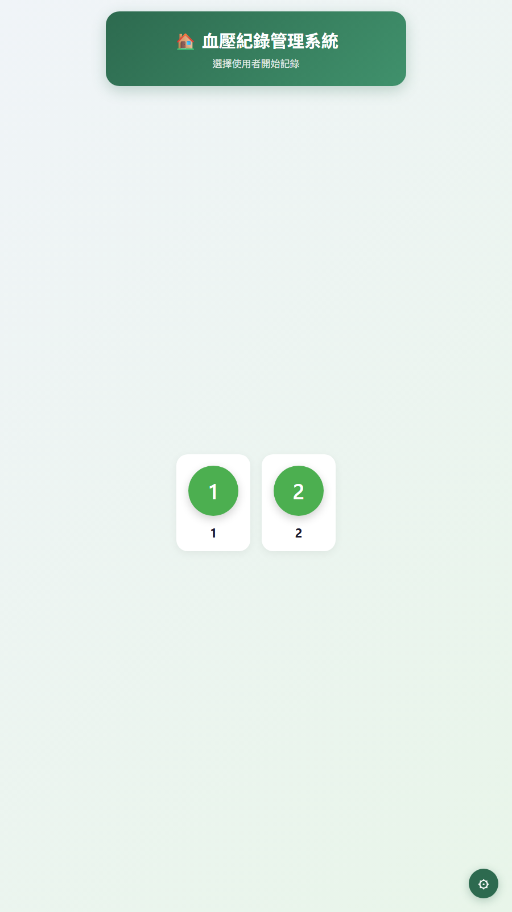
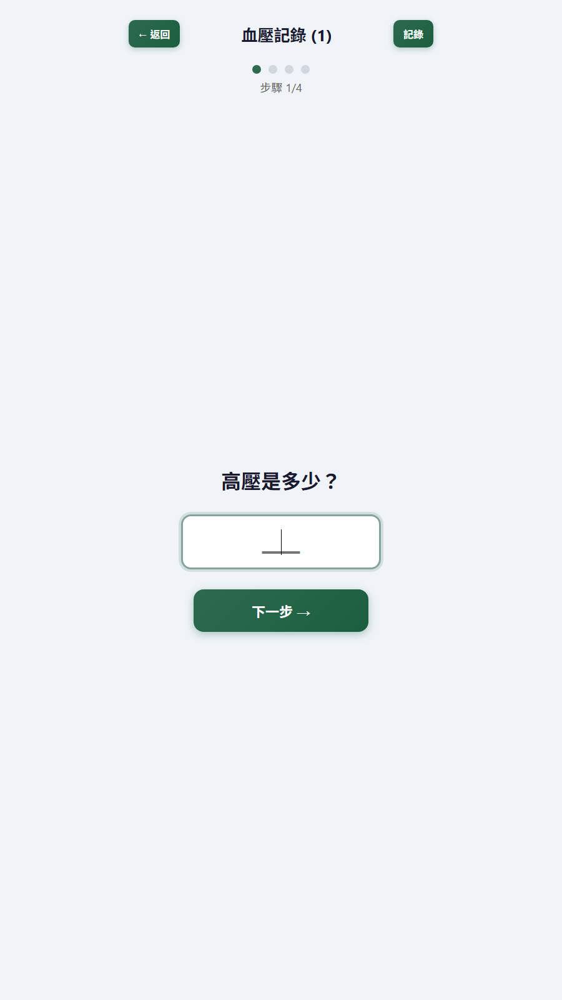
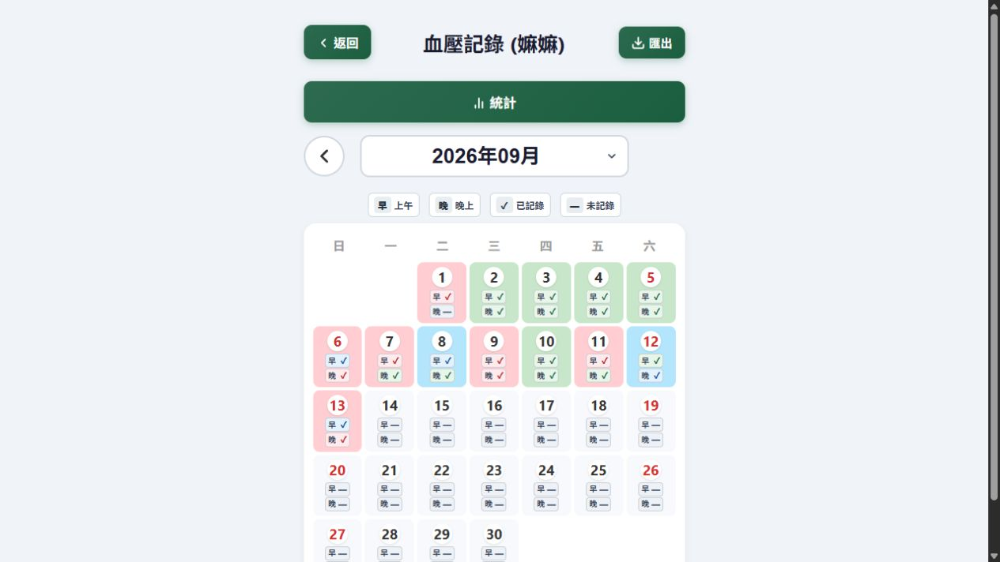
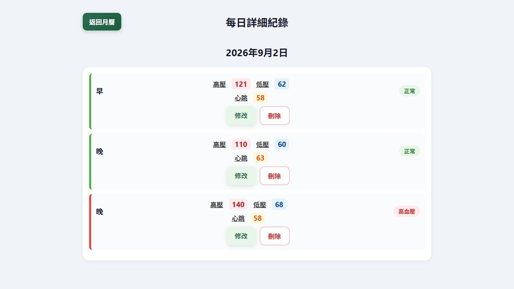
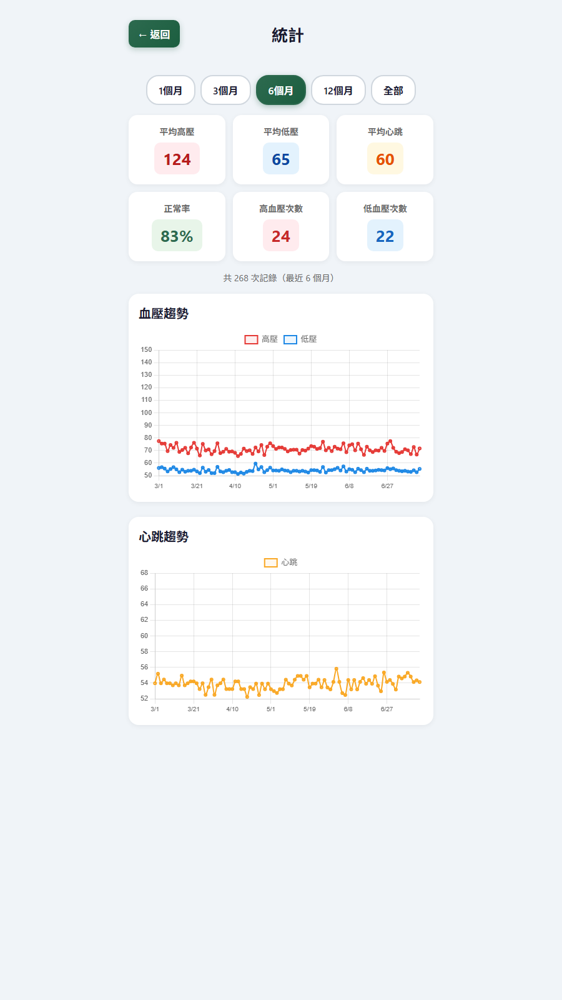
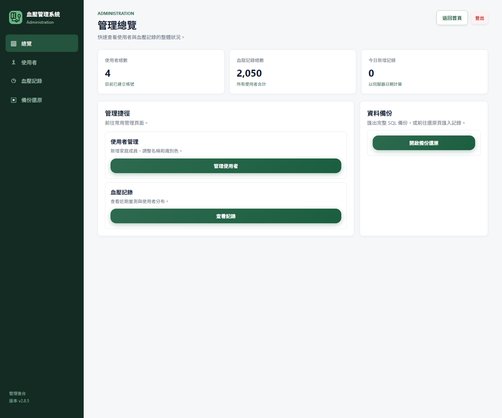

# 血壓記錄系統

<br>

[](https://github.com/shamough1792/Blood_Pressure_Tracker/releases/tag/v2.8.3)
[](https://github.com/shamough1792/Blood_Pressure_Tracker/pkgs/container/blood_pressure_tracker)


<br>

一個用 Node.js、Express、MariaDB 打造的血壓記錄網站，專為長輩設計，簡單易用。

<br>

## 功能特色

<br>

- **多使用者 Portal** — 家庭成員獨立記錄，點擊大頭貼切換，管理後台管理使用者
- **長者友善 4 步驟輸入** — 逐步輸入，預設保留實際錄入時間，也可補錄時指定上午或下午
- **月曆檢視 + 統計圖表** — 全月記錄一目了然，趨勢圖可放大
- **血壓分級顏色** — 正常綠 / 低血壓藍 / 高血壓紅，全介面統一標示
- **Excel 匯出 + SQL 備份** — 日曆格式報表、完整資料庫備份
- **PWA 支援** — 安裝到手機主畫面，像原生 App 般使用
- **Docker 一鍵部署** — 可連 Synology NAS 或其他外部資料庫

<br>

## 快速開始

<br>

### 方式一：Docker（推薦）

#### 使用預先 build 好的 image

```yaml
services:
  app:
    image: ghcr.io/shamough1792/blood_pressure_tracker:latest
    ports:
      - "3000:3000"
    environment:
      TZ: Asia/Hong_Kong
      DB_HOST: 192.168.1.222
      DB_USER: tracker_user
      DB_PASSWORD: 'your_password'
      DB_NAME: blood_test
      ADMIN_USER: admin
      ADMIN_PASSWORD: 'your_admin_password'
      SESSION_SECRET: 'your_random_secret'
    restart: unless-stopped
```

```bash
docker compose up -d
```

#### 自行 build

```yaml
services:
  app:
    build: .
    ports:
      - "3000:3000"
    environment:
      TZ: Asia/Hong_Kong
      DB_HOST: 192.168.1.222
      DB_USER: tracker_user
      DB_PASSWORD: 'your_password'
      DB_NAME: blood_test
      ADMIN_USER: admin
      ADMIN_PASSWORD: 'your_admin_password'
      SESSION_SECRET: 'your_random_secret'
    restart: unless-stopped
```

```bash
docker compose up -d --build
```

### 方式二：手動安裝

#### 環境需求

- Node.js >= 20
- MariaDB >= 10.6

#### 安裝步驟

```bash
npm install
```

#### 建立資料庫

```sql
CREATE DATABASE blood_test;
CREATE TABLE users (
    id INT AUTO_INCREMENT PRIMARY KEY,
    name VARCHAR(50) NOT NULL,
    color VARCHAR(7) NOT NULL DEFAULT '#4CAF50',
    created_at TIMESTAMP DEFAULT CURRENT_TIMESTAMP
);
INSERT INTO users (name, color) VALUES ('使用者', '#4CAF50');
CREATE TABLE records (
    id INT AUTO_INCREMENT PRIMARY KEY,
    high_pressure INT NOT NULL,
    low_pressure INT NOT NULL,
    heartbeat INT NOT NULL,
    recorded_at TIMESTAMP DEFAULT CURRENT_TIMESTAMP,
    user_id INT NOT NULL DEFAULT 1,
    FOREIGN KEY (user_id) REFERENCES users(id)
);
```

#### 環境變數

| 變數 | 說明 | 預設值 |
|------|------|--------|
| `DB_HOST` | 資料庫主機 | `192.168.1.222` |
| `DB_USER` | 資料庫帳號 | `tracker_user` |
| `DB_PASSWORD` | 資料庫密碼 | |
| `DB_NAME` | 資料庫名稱 | `blood_test` |
| `PORT` | 網站埠號 | `3000` |
| `ADMIN_USER` | 管理後台帳號 | |
| `ADMIN_PASSWORD` | 管理後台密碼 | |
| `SESSION_SECRET` | Session cookie 簽名密鑰（高熵隨機） | |

#### 啟動

```bash
npm start
```

開啟 http://localhost:3000 即可看到使用者選擇頁。

<br>

## 管理後台認證

管理後台位於 `/admin`，需登入才能管理使用者、匯入 SQL 或下載 SQL 備份；一般血壓記錄功能維持公開。

設定三個環境變數後，使用以下指令產生高熵的 `SESSION_SECRET`：

```bash
node -e "console.log(require('crypto').randomBytes(32).toString('base64url'))"
```

任一個認證變數未設定時，服務不會啟動。Session cookie 具 `HttpOnly` 與 `SameSite=Lax` 屬性，於 production 加上 `Secure`；部署需透過 HTTPS reverse proxy（如 Synology 的 reverse proxy）提供 TLS，請勿直接將 3000 port 暴露到公網。

<br>

## Docker 部署

<br>

### 使用外部資料庫（如 Synology NAS）

```yaml
services:
  app:
    build: .
    ports:
      - "3000:3000"
    environment:
      TZ: Asia/Hong_Kong
      DB_HOST: 192.168.1.222
      DB_USER: tracker_user
      DB_PASSWORD: 'your_password'
      DB_NAME: blood_test
      ADMIN_USER: admin
      ADMIN_PASSWORD: 'your_admin_password'
      SESSION_SECRET: 'your_random_secret'
    restart: unless-stopped
```

<br>

## 畫面截圖

<br>



<br>



<br>



<br>



<br>



<br>



<br>

## 版本紀錄

<br>

* 0.1 — 初始版本
* 0.2 — UI 更新，新增成功提示
* 0.3 — 錯誤修正，自動重新連線
* 0.3.5 — CSV 輸出優化
* 0.4 — CSV 檔名格式、網站圖示
* 0.5 — 改用 Excel 匯出、版面調整
* 0.5.1 — 無資料時匯出錯誤修正
* 0.6 — 記錄按月分組、新增修改功能
* **1.0** — 長者友善改版、4 步驟輸入、卡片檢視、PWA、Docker、Excel 顏色標示
* **2.0** — 多使用者 Portal、管理後台、SQL 匯入、使用者名稱顯示
* **2.1** — 低血壓提示
* **2.2** — 月曆檢視、PWA 快取更新優化
* **2.3** — 統計圖表、每月摘要、SQL 備份匯出、按鈕美化
* **2.3.1** — 統計頁優化：每日聚合圖表、全部範圍修正、全屏放大檢視
* **2.3.2** — Docker image 瘦身：移除未用套件、改用 Alpine，508MB → 298MB
* **2.3.3** — 全部 emoji 改用 SVG 圖示，跨裝置顯示一致
* **2.4** — 代碼重構（路由拆分）、血壓輸入驗證、上傳限制、操作記錄 Log
* **2.4.1** — 重覆記錄警告：同日同時段已有記錄時提示確認。
* **2.5** — 管理後台 Session 認證：登入頁、HMAC 簽名 Session cookie、dotenv 支援、管理 API 保護
* **2.6** — 介面優化：首頁使用者選擇、月曆早晚標示、健康摘要及全站標題置中
* **2.7** — 月曆改用早／晚雙列狀態顯示，提升手機閱讀清晰度
* **2.7.1** — 修正 iOS 窄螢幕月份選擇器文字被裁切問題
* **2.8.0** — 新增單日詳細紀錄頁，改善月曆日期導覽及桌面版面配置
* **2.8.1** — 修正內網 HTTP 管理員登入 cookie 無法保存問題
* **2.8.2** — 月曆以特殊外框標示當天日期
* **2.8.3** — 優化首頁與手機版版面、改善月曆與卡片顯示、修正記錄時間保留及補錄時段選擇

<br>

## 作者

<br>

[shamough1792](https://github.com/shamough1792)

<br>

## 授權

<br>

本專案採用 MIT 授權 — 詳見 [LICENSE.md](LICENSE.md)

<br>
