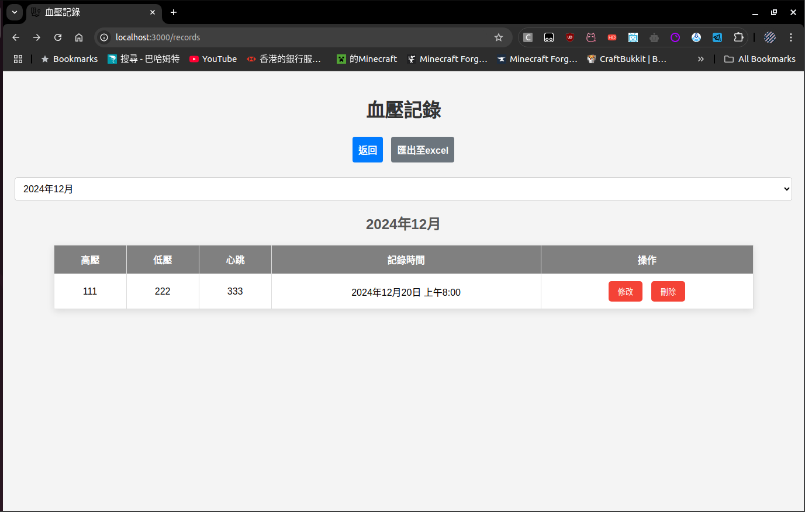

# Blood Pressure Record 記錄血壓

<br>

Blood Pressure Recording Website.

<br>

## Description

<br>

The Blood Pressure Tracker is a web application built using Node.js and MariaDB. This application allows users to easily record, track, and view their blood pressure data over time. Users can input their blood pressure measurements, including high pressure, low pressure, and heart rate. The readings are automatically timestamped and stored in the database. Users can then view their past blood pressure readings in a chronological order, with each entry displayed in a user-friendly format.

<br>

## Getting Started

<br>

### Dependencies

* Linux
* Node.js version >= 20.16.0
* MySql >= 15.1 Distrib 10.6.10-MariaDB

<br>

### Installing

* Download the file from latest release or download the source file.
* Create new folder to contain all the file from release.

<br>

### Executing program

* Open the terminal in the directory of js file and package.json.

```
npm install
```

```
node server.js
```

<br>

## Setup

<br>

* Setup database

```
sudo apt install mariadb-server
```
```
sudo mysql -u root -p
```

```
CREATE USER 'tracker_user'@'localhost' IDENTIFIED BY 'Your_Password';
```

```
CREATE DATABASE blood_pressure_tracker;
```

```
USE blood_pressure_tracker;
```

```
CREATE TABLE records (
    id INT AUTO_INCREMENT PRIMARY KEY,
    high_pressure INT NOT NULL,
    low_pressure INT NOT NULL,
    heartbeat INT NOT NULL,
    recorded_at TIMESTAMP DEFAULT CURRENT_TIMESTAMP
);
```

```
GRANT ALL PRIVILEGES ON blood_pressure_tracker.* TO 'tracker_user'@'localhost';
```

* Replace the Your_Password with your password.


<br><br>

* Setup server.js

```
// Database connection
const db = mysql.createConnection({
    host: 'localhost',
    user: 'tracker_user', // replace with your MariaDB username
    password: 'Your_Password', // replace with your MariaDB password
    database: 'blood_pressure_tracker'
});
 ```

* Replace the Your_Password with your password.

<br>

```
const port = 3000;
```
* Default Port of the website is 3000.

<br><br>

## Screenshot Of The Website




<br>

## Authors

<br>

[shamough1792](https://github.com/shamough1792)

<br>

## Version History

<br>

* 0.1
    * Initial Release.

* 0.2
    * Update UI.
    * Adding pop up when successful add new record.
 
* 0.3
    * Fixed package.json.
    * Fixed record data problem.
    * Added auto reconnect to database to avoid time out.

* 0.3.5
    * Update the CSV output order by date.
    * Update the CSV date and time format.

* 0.4
    * Update the output CSV name format.
    * Added favicon.

* 0.5
    * Changed output .xlsx instead of .csv.
    * Moved buttons in records page to top.
    * Now show records order by DESC.

<br>

## Future Planning

<br>

* Multi-language support.
* Multi-user support.

<br>

## License

<br>

This project is licensed under the MIT License - see the [LICENSE.md](LICENSE.md) file for details

<br>

## Acknowledgments

<br>

* [Poe](https://poe.com/)

<br>
